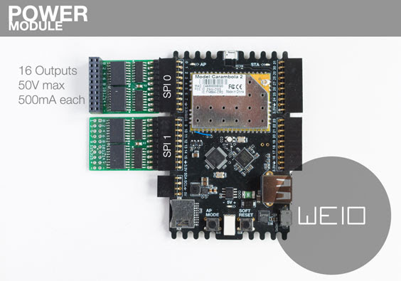

Board and HW
============

### WeIO board overview

The WeIO hardware module is composed by the following elements :

* A Wireless SoC Module ([Carambola2](http://www.8devices.com/carambola-2)) that acts as the system core.
* A coprocessor ([NXP LPC11U24](http://www.nxp.com/documents/data_sheet/LPC11U2X.pdf)) which is used to assure the real-time aspects of the system and exposes GPIO, PWM, I2C, UART, SPI and ADC.
* An FTDI chip ([FT232-RQ](http://www.ftdichip.com/Support/Documents/DataSheets/ICs/DS_FT232R.pdf)), used for the debug console
* A USB Hub ([Microchp USB2640](http://www.microchip.com/wwwproducts/Devices.aspx?product=USB2640)), used to extend the USB ports of the board and providing a SD card interface
* An I2C temperature sensor ([LM75](http://www.nxp.com/products/sensors/i2c_temperature_voltage_monitors/LM75BD.html))
* An RGB LED
* Header with all the availables IOs

The complete schematic and BOM can be found on [Github](https://github.com/nodesign/weioBoard)

#### Reference documentation

**Datasheet**

* [AR9331](https://www.openhacks.com/uploadsproductos/ar9331_datasheet.pdf) 
* [Carambola2](http://www.8devices.com/media/files/Carambola2%20advanced.pdf) 
* [LPC11U24 User manual](http://www.keil.com/dd/docs/datashts/arm/cortex_m0/r0p0/dui0497a_cortex_m0_r0p0_generic_ug.pdf)
* [LPC11U2x Reference manual](http://www.keil.com/dd/docs/datashts/nxp/lpc11uxx/lpc11u2x.pdf)
* [LM75](http://www.nxp.com/products/sensors/i2c_temperature_voltage_monitors/LM75BD.html)
* [USB2640](http://www.microchip.com/wwwproducts/Devices.aspx?product=USB2640) 

**Useful links**

* [Board schematics on Github](https://github.com/nodesign/weioBoard)
* [UPER firmware on Github](https://github.com/ks156/UPER)
* [SFP on Github](https://github.com/GiedriusM/SFP)
* [Build the WeIO firmware](https://github.com/nodesign/weio/wiki/Build-the-firmware)

#### Wireless SoC module
The Wireless SoC Module is a [Carambola2 module](http://www.8devices.com/carambola-2) made by [8devices](http://www.8devices.com/).

It is build around an [Qualcomm Atheros](http://www.qca.qualcomm.com/) [AR9331](https://www.openhacks.com/uploadsproductos/ar9331_datasheet.pdf).
The AR9331 is [MIPS 24K](http://www.linux-mips.org/wiki/24K) MCU, running at 400MHz.
The Carambola2 module contains 16MB of flash and 64MB of RAM, and is Wifi 802.11b/g/n compliant.

The base system is based on [OpenWRT](https://openwrt.org/), a Linux distribution specifically made for embedded devices.

No GPIO exposed on the pin-headers come from this module. First, there's not enough GPIOs available on the Carambola2 module to create a complex application. The second point is that these GPIOs are only 2V55 tolerent, which makes them vulnerable during the development process. The third reason is that OpenWRT is not a real-time system, making it difficult to create a project in which timing constraints are important, which is mostly the case when dealing with hardware sensors or actuators.

That's the reason why a co-processor has been added.

##### Technical informations
Even if the GPIO exposed on the pin-headers come from the co-processor, the following board components are wired directly on the Carambola2 module :

* *AP Mode* switch on GPIO20 (Carambola2 module, pin 4)
* *SOFT RESET* switch on GPIO15 (Carambola2 module, pin 37)
* *STA* LED on LED5 (Carambola2 module, pin 36)
* *AP* LED on LED1 (Carambola2 module, pin 40)
* *LM75* sensor on I2C : SDA on GPIO18 and SCL on GPIO19 (Carambola2 module, pins 6 and 5)

A shell is always available via the COM port when the board is powered through USB. The communication configuration is : 115200 bauds 8N1 (8 bits, no parity, 1 stop bit)

##### Electrical characteristics
The power consumption of the Carambola2 module is not precisely known and is hard to determines. Some hints can be found [here](http://jeelabs.org/2013/05/07/carambola-2-power-consumption/). This consumption will highly depends of the Wireless state.

#### Co-processor
As seen above (Wireless SoC module), the co-processor aims to provide robust and versatile GPIOs as well as assuring real-time exigences. 
In adition, the co-processor provides hardware modules such as PWM, ADC, SPI, I2C and UART. 

The co-processor is an [ARM Cortex-M0](http://www.arm.com/products/processors/cortex-m/cortex-m0.php) 32 bit MCU [LPC11u24](http://www.nxp.com/documents/data_sheet/LPC11U2X.pdf) from NXP, running at 48MHz.

The communication between the co-processor and the wireless module is made through USB. The co-processor implement a [CDC interface](http://en.wikipedia.org/wiki/USB_communications_device_class) to assure the communication.

A protocol, [SFP](https://github.com/GiedriusM/SFP/wiki) (acronym of Simple Function Protocol) is used to send commands and get status back. 

##### Electrical characteristics
The electrical characteristics of the LPC11u24 can be found [in the LPC11u2x datasheet](http://www.keil.com/dd/docs/datashts/nxp/lpc11uxx/lpc11u2x.pdf)

Here's a short summary of the most important characteristics :

**GPIO**

* Vi : Input voltage : 5V
* Vo : Output voltage : Vdd (3V3)
* Ioh : Output current : 4mA (Vdd-0.4V); 16mA (Vdd-1V)

**ADC**

* Via : Analog input voltage : Vdd (3V3)
* Cia : Analog input capacitance : 1pF max
* Ri : Input resistance : 2.5MOhm max

### Power Module

Up to two power modules can be plugged into a WeIO board, offering 16 outputs for each module.
Each output can drive actuators consuming up to 50V and 500mA.

Connect the desired power supply to the +V and GND pins of the module.
Then connect each of the output pins to one pin (the + one if available) of each of your actuators, and the other pin of the actuator to the common GND of the module.

Notice that the module is a current amplifier, so it will work directly with motors, lamps or other « continuous » actuators, or relays.
In order to dim LEDs, it is necessary to create software PWM, or [BCM](http://www.batsocks.co.uk/readme/art_bcm_1.htm) or to use the PWM outputs of the WeIO (with an optional [Darlington array](http://be.farnell.com/fr-BE/stmicroelectronics/uln2803a/darlington-array-8npn-2803-dip18/dp/1094428) if required by the power consumption), or a SPI LED driver (such as [this one](http://be.farnell.com/fr-BE/texas-instruments/tlc5916in/ic-led-driver-8ch-pdip16/dp/1647814)), which are actually more appropriate techniques.

A good place to start using the powerModule is the powerModule example from the actuators folders. 

Technical description of the power module:
The Power Module is composed of two [8 bit shift registers](http://www.nxp.com/documents/data_sheet/74HC_HCT595.pdf) driving 2 [arrays of 8 Darlington transistors.](http://www.ti.com/lit/ds/symlink/uln2803a.pdf). See more on the [power module’s repository.](https://github.com/nodesign/weioPowerModule)