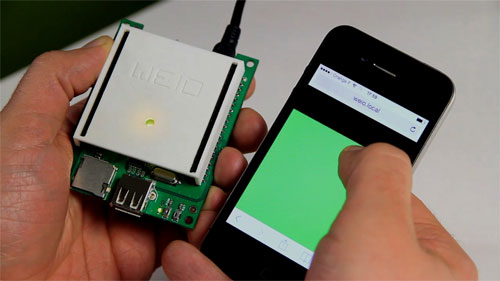

WeIO how it works
=================

### Magic behind a scene
Do you want to know what is behind a scenes of this short video? Sure you do. Here you can fins all details about a few awesome projects that we made with WeIO from easy to hard.

Drive color LED from HTML5
==========================

In this example the idea is to drive RGB LED on WeIO board only using HTML5. Main idea behind is to make one slider with 255 steps and use them to change Hue component of the color.


Connecting slider to LED
-------------------------
### Installing UI library, index.html
One of the most convinient library for making UI components are jQuery UI. You can see more information about it here http://jqueryui.com/.
For this project we needed to download a few additional files from jQuery UI that are not included by default in WeIO framework : jquery-ui.css, jquery-ui.min.js and jquery.ui.touch-punch.min.js. Upload them inside you project and now you are ready to programm. Here is how looks HTML header. However it's possible to directly call libraries from web urls if your object has Internet connection.
Notice that you still don't have style.css file, il will be created in next steps.
``` html
<head >
    <meta name="viewport" content="width=device-width, initial-scale=1.0, maximum-scale=1.0">

    <link rel="stylesheet" href="jquery-ui.css">
    <link rel="stylesheet" href="style.css" />

    <script data-main="weioLibs/weio" src="weioLibs/require.js"></script>
    <script src="jquery-ui.min.js"></script>
    <script src="jquery.ui.touch-punch.min.js"></script>


    <title>Slider to LED</title>
</head>
});
```

### Setting up slider in HTML, index.html
Here is how looks like calling slider in html.

```html
<body>

    <div id="slider-vertical"></div>

</body>
```
### Adding some custom CSS, style.css
The most tricky thing is setting slider that can be called whitin from smartphones and avoid page scrolling at the same time. This is made by our custom CSS file. Create style.css file. It should look like this :
```css
html, body {
    margin: 0;
    padding: 0;
    height: 100%;
}
body {
    background: #000000;
}
.slider-vertical {
    bottom: 0px;
    z-index: 10000;
    min-height: 544px;
    width: 100%;
    height: 100%;
}
.ui-slider-handle {
    display: none;
    overflow: hidden;
}
.slider-vertical, .ui-slider, .ui-slider-vertical, .ui-widget, .ui-widget-content, .ui-corner-all, .ui-slider-range, .ui-widget-header, .ui-slider-range-min {
    position: absolute !important;
}
```

### Javascript slider handler, index.html inside <script></script>
This function is the heart of this simple project. All logic and calculation is done here.This handler is called each time when slider gets manipulated. To change color with only one value that comes from slider is more simple to do in HSV color model (hue, saturation, value) than in RGB (red, green, blue). In that case changing only value of hue changes color in the spectrum. Remark that value from slider (0-255) is converted in the range 0.0-1.0 to be served inside a function HSVtoRGB as hue. That value is converted to RGB so we can export it as PWM signal (pwmWrite) that drives 3 LEDs.

````javascript
var p_id = 0;
$(function() {
    $("#slider-vertical").slider({
        orientation: "vertical",
        range: "min",
        min: 0,
        max: 255,
        value: 10,
        slide: function(event, ui) {
            var id = ui.value;
            if (id != p_id) {
                var hue = (1.0 / 255.0) * ui.value;
                var ledColor = HSVtoRGB(hue, 1.0, 1.0);
                pwmWrite(21, ledColor.r);
                pwmWrite(20, ledColor.g);
                pwmWrite(19, ledColor.b);
                changeColorFromWeio(ledColor);
            }
            p_id = id;
        }
    });
});
```

### Implementing HSVtoTGB function, index.html inside <script></script>
This function is taken from terrific Parthik Gosar's code found on this site http://axonflux.com/handy-rgb-to-hsl-and-rgb-to-hsv-color-model-c
```javascript
/*
 * From Parthik Gosar's link in this comment with slight modification to let you enter each value independently or all at once as an object
 * accepts parameters
 * h  Object = {h:x, s:y, v:z}
 * OR
 * h, s, v
*/
function HSVtoRGB(h, s, v) {
    var r, g, b, i, f, p, q, t;
    if (h && s === undefined && v === undefined) {
        s = h.s, v = h.v, h = h.h;
    }
    i = Math.floor(h * 6);
    f = h * 6 - i;
    p = v * (1 - s);
    q = v * (1 - f * s);
    t = v * (1 - (1 - f) * s);
    switch (i % 6) {
        case 0: r = v, g = t, b = p; break;
        case 1: r = q, g = v, b = p; break;
        case 2: r = p, g = v, b = t; break;
        case 3: r = p, g = q, b = v; break;
        case 4: r = t, g = p, b = v; break;
        case 5: r = v, g = p, b = q; break;
    }
    return {
        r: Math.floor(r * 255),
        g: Math.floor(g * 255),
        b: Math.floor(b * 255)
    };
}
```
### Download source code of the project
Follow this link to download WeIO archive that you can directly test on your board

# Examples

## Analog

### analogRead_PY
 
This example shows you how to read analog input from the physical world using a potentiometer. A potentiometer is a simple mechanical device that provides a varying amount of resistance when its shaft is turned. By passing voltage through a potentiometer and into an analog input on your Arduino, it is possible to measure the amount of resistance produced by a potentiometer (or pot for short) as an analog value. In this example you will monitor the state of your potentiometer using IDE console. 

#### Circuit
Connect the three wires from the potentiometer to your WeIO board. The first goes to ground from one of the outer pins of the potentiometer. The second goes from 3.3 volts to the other outer pin of the potentiometer. The third goes from analog input 31 to the middle pin of the potentiometer. 

By turning the shaft of the potentiometer, you change the amount of resistance on either side of the wiper which is connected to the center pin of the potentiometer. This changes the voltage at the center pin. When the resistance between the center and the side connected to 3.3 volts is close to zero (and the resistance on the other side is close to 10 kilohms), the voltage at the center pin nears 3.3 volts. When the resistances are reversed, the voltage at the center pin nears 0 volts, or ground. This voltage is the analog voltage that you're reading as an input.

The WeIO has a circuit inside called an analog-to-digital converter that reads this changing voltage and converts it to a number between 0 and 1023. When the shaft is turned all the way in one direction, there are 0 volts going to the pin, and the input value is 0. When the shaft is turned all the way in the opposite direction, there are 3.3 volts going to the pin and the input value is 1023. In between, analogRead() returns a number between 0 and 1023 that is proportional to the amount of voltage being applied to the pin. 

#### Code

In the program below, the only thing that you do will in the setup function is to attach myProcess function to main process with the command:

**attach.process(myProcess)**

Next, in myProcess function, you need to set the pin of your analog input and create an infinite loop:

**pin = 31**  
**while True:**

Finally, you need to print the analog value to your monitor every 100 milliseconds. You can do this with the commands **print**, **annalogRead(pin)** and **delay()**. You can also add some text to your printed string to make it more showy :

**print "analogRead pin ",pin," = ",analogRead(pin)**  
**delay(100)**

Now, when you open your IDE Monitor you should see a steady stream of numbers ranging from 0-1023, correlating to the position of the pot. As you turn your potentiometer, these numbers will respond almost instantly. 

```python
from weioLib.weio import *

def setup():
	attach.process(myProcess)

def myProcess():
	pin = 31
	while True:
		print "analogRead pin ",pin," = ",analogRead(pin)
		delay(100)
```
