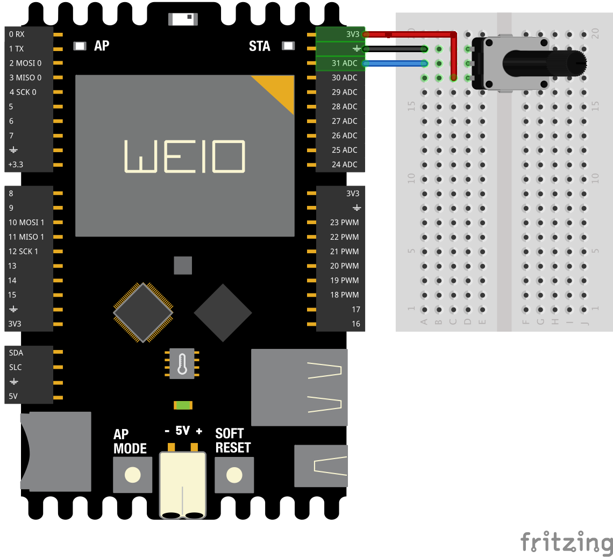
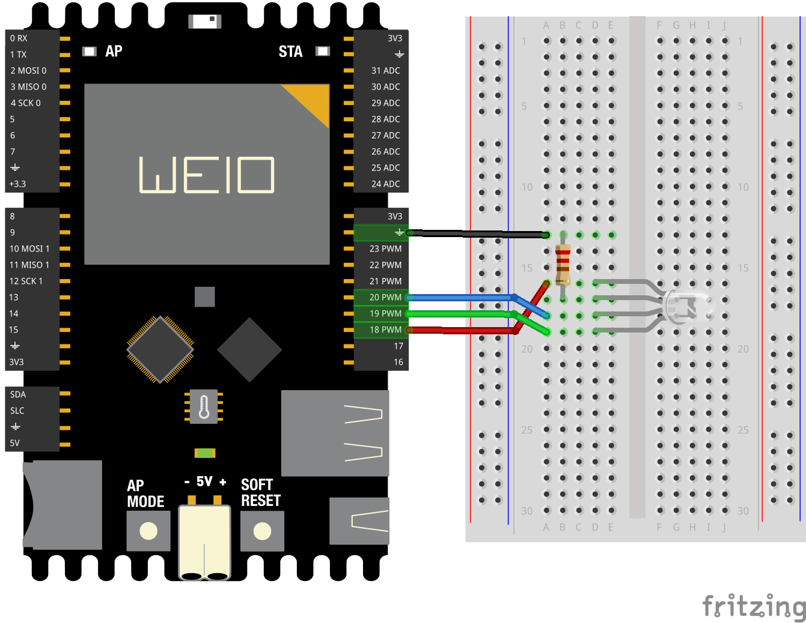
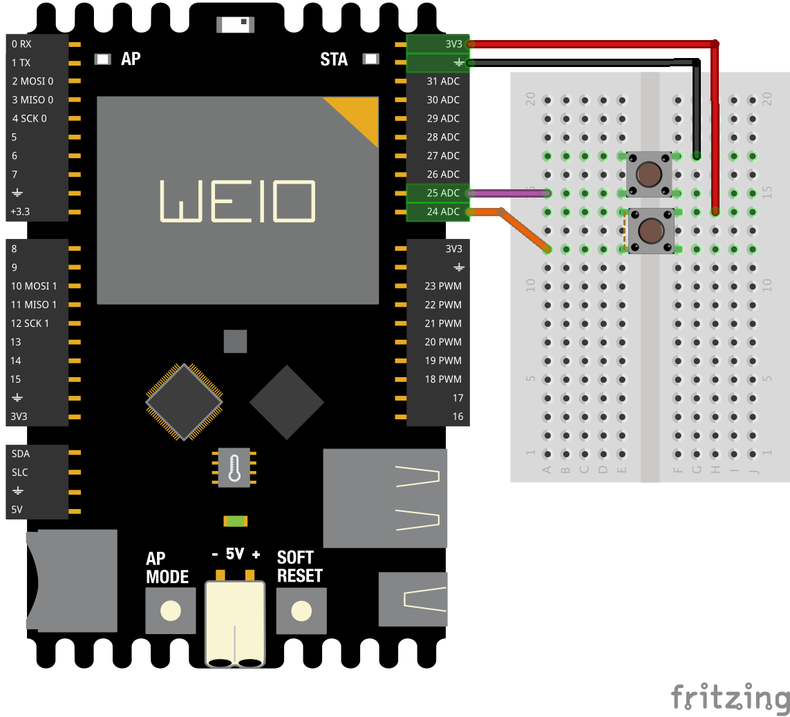

Examples
========

Actuators
---------

Analog
------

### analogRead_PY & JS
This examples shows you how to read analog input from the physical world using a potentiometer. A potentiometer is a simple mechanical device that provides a varying amount of resistance when its shaft is turned. By passing voltage through a potentiometer and into an analog input on your WeIO, it is possible to measure the amount of resistance produced by a potentiometer as an analog value. In this examples you will monitor the state of your potentiometer using IDE console (python example) and web user interface (html/JS example). 

#### Circuit

Connect the three wires from the potentiometer to your WeIO board. The first goes to ground from one of the outer pins of the potentiometer. The second goes from 3.3 volts to the other outer pin of the potentiometer. The third goes from analog input 31 to the middle pin of the potentiometer.
<br></br>
By turning the shaft of the potentiometer, you change the amount of resistance on either side of the wiper which is connected to the center pin of the potentiometer.
<br></br>
This changes the voltage at the center pin. When the resistance between the center and the side connected to 3.3 volts is close to zero (and the resistance on the other side is close to 10 kilohms), the voltage at the center pin nears 3.3 volts. When the resistances are reversed, the voltage at the center pin nears 0 volts, or ground. This voltage is the analog voltage that you're reading as an input.
<br></br>
The WeIO has a circuit inside called an analog-to-digital converter that reads this changing voltage and converts it to a number between 0 and 1023. When the shaft is turned all the way in one direction, there are 0 volts going to the pin, and the input value is 0. When the shaft is turned all the way in the opposite direction, there are 3.3 volts going to the pin and the input value is 1023. In between, **analogRead()** returns a number between 0 and 1023 that is proportional to the amount of voltage being applied to the pin. 

#### Code: analogRead_PY
In the program below, the only thing that you do will in the **setup()** function is to attach myProcess function to main process with the command:

``` python
attach.process(myProcess)
```
 
Next, in myProcess function, you need to set the pin of your analog input and create an infinite loop for the reading :

``` python
pin = 31
while True:
```

Finally, you need to print the analog value to your monitor every 100 milliseconds. You can do this with the commands **print "your text"**, **annalogRead(pin)** and **delay(ms)**. You can also add some text to your printed string to make it more showy (use commas to concat strings) :

``` python
print "analogRead pin ",pin," = ",analogRead(pin)
delay(100)
```

Now, when you run the code you should see in the IDE Monitor a steady stream of numbers ranging from 0-1023, correlating to the position of the pot. As you turn your potentiometer, these numbers will respond almost instantly. 

``` python
from weioLib.weio import *

def setup():
	attach.process(myProcess)

def myProcess():	
	pin = 31
	while True:
		print "analogRead pin ",pin," = ",analogRead(pin)
		delay(100)
```

#### Code: analogRead_JS

##### User interface: index.html
In the program below the visible page content, the body, contains only a paragraph with id **"phrase"**. This paragraph will be used to display the potentiometer value :

``` html
<p id="phrase" ></p>
```

To update this value you need to use JavaScript and JQuery functions. You can define what to do When page is loaded and websocket opened whit this function :

``` javascript
function onWeioReady() { ... }
```

In this example you need to set a timer every 100 milliseconds : 

``` javascript
setInterval(function() { ... }, 100);
```

To read the potentiometer value every 100 milliseconds you need to call analogRead() function.

``` javascript
analogRead(31,pinCallback);
```

This functins works like in python but needs an extra parameter, the callback function, that is received message from IDE server to user interface. This callback contains analog value an pin number.

``` javascript
function pinCallback(data) { ... }
```

Using Jquery you can update paragraph text :

``` javascript
$("#phrase").html("ANALOGREAD VALUE ON THE PIN 31 IS "+ data.data);
```

Now when you open the web user interface you should see a new phrase every 100 millisenconds with potentiometer value.
 
``` html
<!DOCTYPE html>
<html lang="en">
<head >
    <script data-main="www/libs/weioLibs" src="www/libs/require.js"></script>
    <link rel="stylesheet" type="text/css" href="myStyle.css">
    <script>
        
        function onWeioReady() {
            // Do something every 100ms
            setInterval(function() {
            //pinCallback will be called when data arrives from server
            analogRead(31,pinCallback);
            }, 100);
        }
        
        function pinCallback(data) {
            // update displayed phrase
            $("#phrase").html("ANALOGREAD VALUE ON THE PIN 31 IS "+ data.data);
        }
    </script>
</head>

<body>
    <p id="phrase" ></p>
</body>

</html>
```

##### Custom CSS style: myStyle.css
This simple CSS shows you how to stylize your user interface setting centered text, Helvetica font family, bold font weight and variable font size (15% of the smallest viewport side) :
 
``` css
p {
    font-family: Helvetica;
    font-size: 15vmin;
    font-weight:bold;
    text-align: center
}
```

Arduino
-------
### firmata

Digital
-------

### blink_PY
This example shows the simplest thing you can do with a WeIO to see physical output: it blinks an RGB LED on board.

#### Circuit

WeIO have an RGB LED attached to pins 18, 19 and 20 on the board itself. If you run this example with no hardware attached, you should see that LED blink.
<br></br>
To build the circuit with an RGB LED, attach 220-ohm resistor to long leg and connect it to ground. Then attach pins 18, 19 and 20 to red, gren and blue legs, respectively.
<br></br>
Now when you run your code you should see that board LED plus external LED blink.

  
#### Code
In the program below, the first thing you do is to attach **blinky()** function to main process with the command :

``` python
attach.process(blinky)
```

In the **blinky()** function, you create an infinite loop to change the state of the pins :

``` python
while True:
```

You turn the LED on with the command :

``` python
digitalWrite(18, HIGH)
```

This supplies **3.3 volts** to **pin 18**. That creates a voltage difference across the pins of the LED, and lights it up. Then you turn it off with the command :

``` python
digitalWrite(18, LOW)
```

That takes **pin 18** back to **0 volts**, and turns the LED off. 

In between the on and the off, you want enough time for a person to see the change, so the **delay()** commands tell the WeIO to do nothing for **100 milliseconds**.


```python
from weioLib.weio import *

def setup() :
    # Attaches blinky function to infinite loop
    attach.process(blinky)

def blinky() :
    while True:
        # write HIGH value to digital PINS 18, 19 & 20
        digitalWrite(18, HIGH) # red led
        digitalWrite(19, HIGH) # green led
        digitalWrite(20, HIGH) # blue led
        # wait 100ms
        delay(100)
        # write LOW value to digital PINS 18, 19 & 20
        digitalWrite(18, LOW) # red led
        digitalWrite(19, LOW) # green led
        digitalWrite(20, LOW) # blue led
        # wait 100ms
        delay(100)
```	

###  digitalWrite_JS
This example shows the simplest thing you can do with a WeIO to do physical actions from user interface: it turns on and off an RGB LED on board by touching or cliking your screen.

#### Circuit

WeIO have an RGB LED attached to **pins 18, 19 and 20** on the board itself. If you run this example with no hardware attached, you should see that LED turn on or off.
<br></br>
To build the circuit with an RGB LED, attach 220-ohm resistor to long leg and connect it to ground. Then attach **pins 18, 19 and 20** to red, gren and blue legs, respectively.
<br></br>
Now when you run your code and go to web user interface you should control the state of that board LED plus external LED.


#### Code
In the program below the visible page content, the body, contains only a paragraph with id **"phrase"**. This paragraph will be used to display current pins values and call **lights()** function by cliking :

``` html
<p id="phrase" onclick="lights()"></p>
```

First you need to create **light** variable and set initial state of pins, in this case false (**LOW** state). Then you need to define what to do when page is loaded and websocket opened :   

``` javascript
var light = false;

function onWeioReady() { ... }
```

In this example you need to call the main function to initialise displayed phrase. This fucntion test the **light** variable, update displayed phrase and write **HIGH** if **light** variable is true and **LOW** if **light** variable is false : 

``` javascript
lights();
```

You turn the RGB LED on or off with the lines :

``` javascript 
digitalWrite(18, LOW or HIGH);
digitalWrite(19, LOW or HIGH);
digitalWrite(20, LOW or HIGH);
```

Using Jquery you can update paragraph text, background color and font color :

``` javascript 
$("#phrase").html("TURN OFF THE LIGHT!");
$("body").css("background","white");
$("#phrase").css("color","black");
```

Finally you need to tooggle **light** variable with this line :

``` javascript
light = !light;
```

Now when you open the web user interface you should see a text that is digital value on the **pins 18, 19 and 20**. By cliking on this text you can change the state of your pins and lights on or off the RGB LED.

``` html
<!DOCTYPE html>
<html lang="en">

<head >
	<!-- Import weioLibs and link your css style -->
    <script data-main="www/libs/weioLibs" src="www/libs/require.js"></script>
    <link rel="stylesheet" type="text/css" href="myStyle.css">
	
	<script>
		// init light variable
		var light = false;
		// This function is called when DOM is loaded and web socket opened
		function onWeioReady() {
		    lights();
		}
		function lights() {
		    if (light) {
		        // Change displayed phrase, background and font color.
		        $("#phrase").html("TURN OFF THE LIGHT!");
		        $("body").css("background", "white");
		        $("#phrase").css("color", "black");
		        // write LOW on pins
		        digitalWrite(18, LOW);
		        digitalWrite(19, LOW);
		        digitalWrite(20, LOW);
		        // toggle light variable
		        light = !light;
		    } else {
		        // Change displayed phrase, background and font color.
		        $("#phrase").html("TURN ON THE LIGHT!");
		        $("body").css("background", "black");
		        $("#phrase").css("color", "white");
		        // write HIGH on pins
		        digitalWrite(18, HIGH);
		        digitalWrite(19, HIGH);
		        digitalWrite(20, HIGH);
		        // toggle light variable
		        light = !light;
		    }
		}
	</script>
</head>

<body>
    <p id="phrase" onclick="lights()"></p>
</body>

</html>
```

##### Custom CSS style: myStyle.css
This simple CSS shows you how to stylize your user interface :
 
``` css
p {
	cursor:pointer;
	margin:0.2em;
	line-height:1em;
	font-family:Helvetica;
	font-size:200px;
	font-weight:bold;
}
```

### pinMode_PY
This example shows you how to set input mode for digitalRead purpose. Using **IDE console** you will monitor the state of two push-buttons connected to ground and **3.3 volts**. 

#### Circuit

Connect two wires, red and black, from **3.3 volts** and ground pins to the two push-buttons. Then connect orange wire from digital **pin 24** to push-button connected to **3.3 volts** and purple wire from digital **pin 25** to push-button connected to ground pin.
<br></br>
When the push-buttons are open (unpressed) there is no connection between the two legs of the pushbuttons, so the pins are not connected. When the buttons are closed (pressed), it makes a connection between their two legs, connecting the **pin 24** to **3.3 volts** and the **pin 25** to **ground**, so that we read  **HIGH** and  **LOW** values on corresponding pins.
<br></br>
When the push-buttons are open pull-down resistor on the **pin 24** keep the input **LOW** and pull-up resistor on the **pin 25** keep the input **HIGH**.
<br></br>
If you don't set internal pull-up and pull-down resistors the digital value printed in the IDE console could be false. This is because the input is "floating", it will randomly return either **HIGH** or **LOW**. That's why you need a pull-up and pull-down resistor in the circuit. 

#### Code

In the program below, the first thing you do is to attach **buttonLoop** function to main process with the command:

``` python
attach.process(buttonLoop)
```

Next, in **buttonLoop** function, you need to set your input pins and corresponding pin modes with this commands :

``` python
pinDown = 24
pinUp = 25
```

``` python
pinMode(pinDown,PULL_DOWN)
pinMode(pinUp,PULL_UP)
```

In the **buttonLoop** function, you create an infinite loop to read inputs and print values every 500 milliseconds with the command :

``` python
while True:
```

You read the digital value with the command :

``` python
valDown =  digitalRead(pinDown)
```

You print the value on the IDE console with the command :

``` python
print "Pin",pinDown,"state :",valDown
```

The delay() commands tell the WeIO to do nothing for 100 milliseconds :

``` python
delay(500)
```

Now, when you run the code you should see in the IDE Monitor the digital values of pins 24 and 25, correlating to the state of the push-buttons.  


``` python
from weioLib.weio import *

def setup() :
    attach.process(buttonLoop)
    
def buttonLoop() :
    # define pins for reading
    pinDown = 24
    pinUp = 25
    # set pin 25 to pull_up mode
    pinMode(pinDown,PULL_DOWN)
    pinMode(pinUp,PULL_UP)
    # create infinite loop
    while True:
        # read digital value on pin 25
        valDown =  digitalRead(pinDown)
        valUp =  digitalRead(pinUp)
        # print result
        print "Pin",pinDown,"state :",valDown
        print "Pin",pinUp,"state :",valUp
        print ""
        # wait 500ms
        delay(500)
```
			
Interfaces
----------

Processes
---------

pythonAndJS
-----------

### genericMessageOnOff
This example shows you how to send messages from javascript to python using **genericMessage()** function.

#### circuit 

WeIO have an RGB LED attached to **pins 18, 19 and 20** on the board itself. If you run this example with no hardware attached, you should see that LED turn on or off.
<br></br>
To build the circuit with an RGB LED, attach 220-ohm resistor to long leg and connect it to ground. Then attach **pins 18, 19 and 20** to red, gren and blue legs, respectively.
<br></br>
Now when you run your code and go to web user interface you should control the state of that board LED plus external LED.

#### code
In the program below the visible page content, the body, contains two  sections with **div** tag. By cliking on this sections you can send events to python. 

The first one send event **msgFromJStoPy** with message **1**. You can set background color, text and function to call when you click on the section with this command :  

``` html
<div style="background-color:white" 
     onclick='genericMessage("msgFromJStoPy",1)'>             
     CLICK HERE TO SEND EVENT WITH MESSAGE 1 TO PYTHON
</div>
```

The second one send event **"msgFromJStoPy"** with message **0**. You cant set background color, text and function to call when you click with this command :

``` html
<div style="background-color:black" 
     onclick='genericMessage("msgFromJStoPy",0)'>             
     CLICK HERE TO SEND EVENT WITH MESSAGE 0 TO PYTHON        
</div>
```    

Now when you open the web user interface you should see two parts. By cliking on this text you can change the state of your pins and lights on or off the RGB LED.

``` html
<!DOCTYPE html>
<html lang="en">

<head >
    <script data-main="www/libs/weioLibs" 
            src="www/libs/require.js"></script>
 	<link href="www/libs/bootstrap-3.3.0/css/bootstrap.min.css" 
 	      rel="stylesheet" />
    <link href="myStyle.css" rel="stylesheet">
</head>

<body>
    <div style="background-color:white" 
         onclick='genericMessage("msgFromJStoPy",1)'>             
         CLICK HERE TO SEND EVENT WITH MESSAGE 1 TO PYTHON
    </div>
    <div style="background-color:black" 
         onclick='genericMessage("msgFromJStoPy",0)'>             
         CLICK HERE TO SEND EVENT WITH MESSAGE 0 TO PYTHON        
    </div>
</body>

</html>
```

Then in the python side, the main.py, you need to set function to call when event with name **"msgFromJStoPy"** is cached with this command :

``` python
attach.event("msgFromJStoPy", led)
```

``` python
from weioLib.weio import *

def setup() :
    # create event and link to function
    attach.event("msgFromJStoPy", led)

def led(dataIn):
    print "msgFromJStoPy cached, received data:", dataIn
    print " "
    
    # write received data on pins 18, 19 and 20
    digitalWrite(18, dataIn)
    digitalWrite(19, dataIn)
    digitalWrite(20, dataIn)
```

Sensors
-------

### getTemperature_JS

This example shows you how to read WeIO board temperature and display value on web user interface. WeIO have an LM75 termometer on the board itself, the example run with no hardware attached.

#### code

##### User interface: index.html

In the program below the visible page content, the body, contains only a paragraph with id **"phrase"**. This paragraph will be used to display temperature from board termometer :

``` html
<p id="phrase"  ></p>
```

First you need to define what to do when DOM is fully loaded and websocket to WeIO opened with this command :   
  
``` javascript
function onWeioReady() { ... }
```

In this example you need to set a timer every 200 milliseconds : 

``` javascript
setInterval(function() { ... }, 200);
```

To read the termometer value you need to call getTemperature() function :

``` javascript
getTemperature(pinCallback);
```

The callback function is received message from IDE server to user interface. This callback contains temperature value an pin number. You can choice function and parameter names whatever you want (in this example **pinCallback** and **data**):

``` javascript
function pinCallback(data) { ... }
```

Using Jquery you can update paragraph text :

``` javascript
$("#phrase").html("TEMPERATURE ON THE BOARD IS "+ callback.data);
```

Now when you open the web user interface you should see a new phrase every 200 millisenconds with termometer value.

``` html
<!DOCTYPE html>
<html lang="en">

<head>
    <!-- import weioLibs and link css style --> 
    <script data-main="www/libs/weioLibs" 
            src="www/libs/require.js"></script>
    <link rel="stylesheet" type="text/css" href="myStyle.css">

    <script>
		// This function is called when DOM is loaded and web socket opened
        function onWeioReady() {
            // Do something every 200ms
            setInterval(function() {
            // pinCallback will be called when data arrives from server
            getTemperature(pinCallback);
            }, 200);
        }
        
        function pinCallback(callback) {
            // Update displayed phrase using callback data
            $("#phrase").html("TEMPERATURE ON THE BOARD IS "+ 
                               callback.data);
        }
    </script>
</head>

<body>
    <p id="phrase" ></p>
</body>

</html>
```

##### Custom CSS style: myStyle.css

```css
body {
    background:black;
}
p { 
    font-family:Helvetica;
    font-size:100px;
    font-weight:bold;
    color:#5dddf6;
    text-align:center;
}
```

### smartphoneGyro

This example shows you how to read your smartphone gyroscope, diplay angle values on the user interface and monitor on the IDE console.

#### code

```html
<!DOCTYPE html> 
<html lang="en"> 

<head>
    <!-- import weioLibs -->
    <script data-main="www/libs/weioLibs" 
            src="www/libs/require.js"></script>
    <!-- This is gyro library that allow the access
    to gyroscope of the smartphone/tablet from JS  
    Find more info about this library here: http://tomg.co/gyrojs -->
    <script src="gyro.js"></script>
    <meta charset="utf-8" /> 
    <link rel="stylesheet" type="text/css" href="myStyle.css">
      
	<script>
        
        // Setting gyro refresh rate in milliseconds
        gyro.frequency = 200;
        
        // This is gyro callback that will be fired 
        // each time value is refreshed
      	gyro.startTracking(function(o) {
      	    
      	    // get rounded gyroscope angles using parseInt()
      	    var gyroAngles = [parseInt(o.alpha), 
      	                      parseInt(o.beta), 
      	                      parseInt(o.gamma)];
      	                      
      	    // sending angles to python
            genericMessage("gyro", gyroAngles);
			
			// Update displayed values
            $("#alpha").html("alpha :"+gyroAngles[0]);
            $("#beta").html("beta :"+gyroAngles[1]);
            $("#gamma").html("gamma :"+gyroAngles[2]);
    	});
    	
    </script>
</head>
    
<body>    
    <p> GYROSCOPE ANGLES </p>
    <p id="alpha"></p>
    <p id="beta"></p>
    <p id="gamma"></p>

</body>

</html>
```

```python
from weioLib.weio import *

def setup():
    # attaches event/genericMessage "gyro" to function gyroHandler 
    attach.event('gyro', gyroHandler)

def gyroHandler(dataIn):
    # gyroscope angles
    alpha = dataIn[0]
    beta  = dataIn[1]
    gamma = dataIn[2]
    # print gyroscope angles on the console
    print "Gyroscope angles => alpha=",alpha,"beta=",beta,"gamma=",gamma
```

WebApps
-------

WebService
----------


