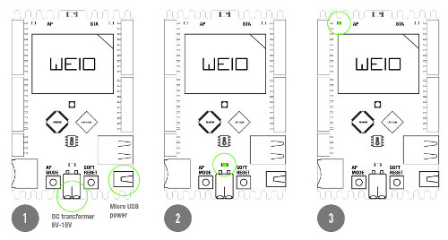
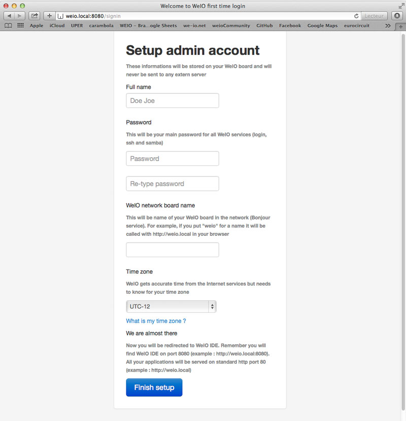
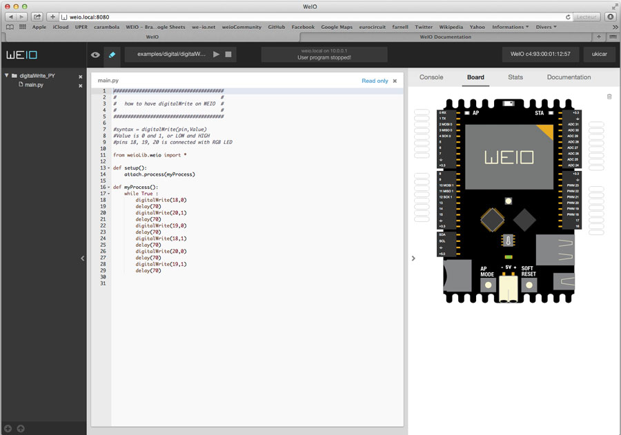
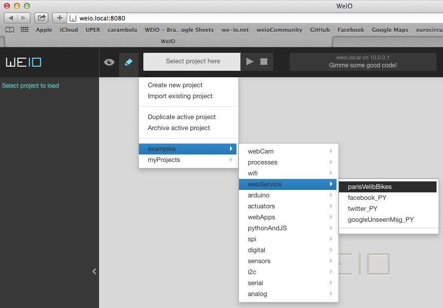
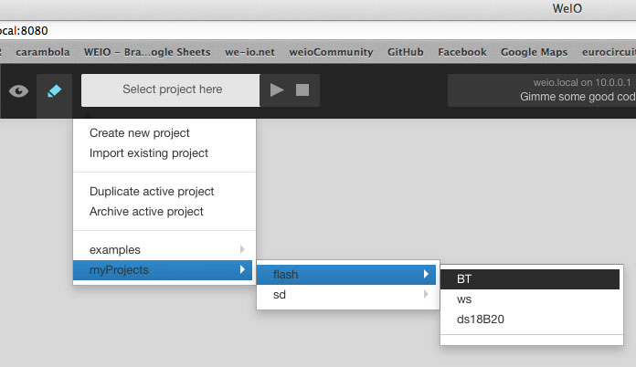
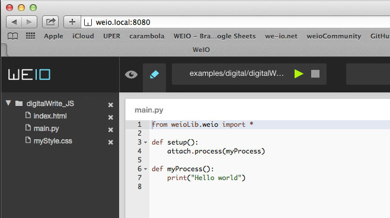

Getting Started
===============

### WeIO

WeIO is an innovative open source hardware and software platform for rapid prototyping and creation of wirelessly connected interactive objects using only popular web languages such as HTML5 or Python.

WeIO consists of the development board and WeIO IDE, locally served (directly from the board) web application that lets you program and control all inputs and outputs on the board from any browser.

Programming of WeIO is easy, as it is done with HTML5 or Python - languages that are loved by designers and programmers.

### Prerequisites - Install on Your PC
WeIO is using `Bonjour` Zeroconf mechanism for automatic discovery ( http://en.wikipedia.org/wiki/Bonjour_(software) ).

Although WeIO can somehow be used without `Bonjour` support on your PC, this is really not recommended. Design choice for `Bonjour` was made exactly because it is widely supported and often present on the PC, depending of the Operating System:

#### Mac OSX and iPhone
Nothing to install - Apple has native support for `Bonjour`

#### Windows
Windows users must install `Bonjour Print Services for Windows` from official Apple's site: http://support.apple.com/kb/DL999

It is because Apple does not distribure MDNS (aka Bonjour) daemon separtely, so the whole package must be installed.

#### Linux
`Avahi` project is traditional way to have mdns support under LInux: http://www.avahi.org 

On Debianesque machines   
`apt-get install avahi`  
should do


### Connect WeIO to Power

There are two ways to bring electricity to the board : using wires from DC transformer (5V only) or using micro USB cable. If you want to start fast use micro USB cable and plug the board into your computer. When using wires make attention to plug them with correct polarity. Powering up the board will result turning on LED power diode. Wait a few moments (about 1 minute) until LED AP stays steady. That means that Linux finished boot process, server is started and you board created AP - Access Point WiFi network that will permit you to enter to IDE Web Interface for the first time.

 This will prompt you the signup screen. If this address don't work it's possible that you don't have support for Bonjour on your machine. However you can always type http://10.0.0.1:8080 and get in WeIO.
After initial sign up into WeIO, everything is ready. 

### Connect to WeIO and First Time Setup
1. After WeIO has been plugged to electricity and AP LED diode is lit up it's possible to connect to it's own WiFi.

2. Choose from available networks on your computer "WeIO MACADDRESSNUMBER" and type inside your web browser:  
http://weio.local:8080.

    >NOTE:  
    >WeIO IDE is always on port `8080` and user application will be on the stantard http port `80`.
    >
    >Also note that if this address (`weio.local`) don't work it's possible that you don't have support for Bonjour on your machine. However you can always type http://10.0.0.1:8080 and get in WeIO.
    >If this problem persists, just click on the button "Soft Reset" on the board.

3. This will prompt you the signup screen.

Please fill in all fields. After setting up root password two additional services will be created : SSH access and SAMBA access.

    > NOTE:  
    > 1. `ssh` will be accessible by  
    >`ssh root@<myBoard>.local`  
    > 2. `Samba` service will use `weio` as the username and the same password as root. These settings can be changed later.

    The default DNS name is `weio.local`, but it will be replaced with your choice in SignUp form, and WeIO will be accessible by `<myBoard>.local`.

    Finally choosing correct country will affect time zone and WiFi regional settings and channel settings for radio.

4. After signup you will be logged into the IDE

WeIO IDE environnement is now present on the screen. The next thing to do is to connect WeIO to your local WiFi network or so called STA network.

  Feel free to explore WeIO WiFi configurator and try to create your own networks or to connect to existants.

  Once WeIO connected to Internet it will update it's local time and date, updates will be accessibles and other objects or services on the network can be directly accessed.

5. To access your board every time from now on (for example after hard restart of the system), point your browser to it by typing in your browser's address bar:   
`<myBoard>.local`

6. If any problem recountred, hit `Soft Reset` button, which will restart just WeIO application (not the whole operating system on the board)


### SSH server
WeIO is available over ssh connection using root as username. Password is the same one provided during signup procedure
```shell
ssh root@weio.local
```
### Samba server
WeIO is available over SMB or Samba sharing. This is used to explore contents of your projects or sources of WeIO platform. This is also  useful for transfering or backuping data between PC and WeIO board. Those who prefer using their own developement tools are welcome using SMB so they can edit codes externally from their prefered IDE.
SAMBA sharing can be accesed using "weio" as username and password is the same one provided during signup procedure.

### Choose project

Explore WeIO examples to see different possibilities.

WeIO examples are READ ONLY so you can preserve them in their original form
However it's good practice to duplicate project inside user space (flash for example) and then edit them



Inside "myProjects" you will find by default "flash" storage. This is integrated flash memory that comes with WeIO (just a few megabytes) but enought to store a lot of pure code projects. 
However it's perfectly normal to add external storage like microSD or USB flash. Once you added a new device, push "SOFT RESET" button on the board and you'll see, after refresh, new storage device avalible in drop down menu.

### Play

When you click on Play, your project runs. Server is launched and main.py is started. You can follow what is happening on the console that is directly connected to the Python output.

When project is running it's possible to connect to server by calling ip address of your board (example http://weio.local) or by clicking on the preview button. For Python only application, console output is all that you'll ever need.

If you wish to run your project automatically on boot check option "Run last project on boot" in setting drop down menu under your name.

### Editor
WeIO uses Ace ajax editor, one of the most performant and complete editor for browsers. Editor autosaves all your changes so there is no need to save manually your projects. Every 4 seconds autosave function saves all your opened files, also files are immediately saved on "Play" or "Preview".
Like all code editors Ace has it's own shortcuts that you can find here :
https://github.com/ajaxorg/ace/wiki/Default-Keyboard-Shortcuts